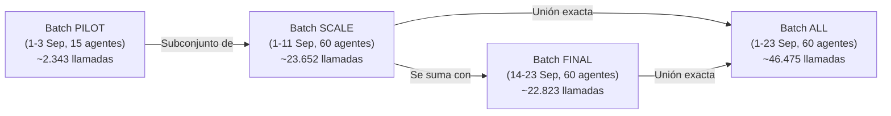

# Handoff y Fuente de Verdad: Generador Analítico Septiembre 2026 para Empresa Demo

> **ESTADO ACTUAL:**
> **"FASE DE GENERACIÓN: PREPARADA, PERO SIN DATOS NUEVOS GENERADOS."**
> **"El siguiente paso autorizado será ejecutar un BATCH PILOT después de validar el entorno."**

---

## 1. Contexto del Proyecto

Estamos preparando la configuración y los datos sintéticos de **Empresa Demo** para una presentación/demo ejecutiva fijada para el **24/09/2026**:

- **`company_id`**: `7`
- **`company_name`**: `Empresa Demo`
- **`company_key`**: `empresa-demo`
- **`is_demo`**: `true`
- **`is_active`**: `true`

El objetivo temporal es que los datos analíticos reflejen actividad histórica realista de contact center que cubra el mes en curso y llegue con total precisión **hasta el 23/09/2026 inclusive** (`2026-09-23 23:59:59 UTC`).

---

## 2. Objetivo Final de Realismo

Queremos que Empresa Demo parezca un contact center vivo y creíble, evitando los problemas del seed inicial (que dispersaba apenas 1 llamada por agente al día a lo largo de 90 días):

- **Volumen diario objetivo:** Entre **50 y 60 llamadas/análisis por agente y día** cuando el agente esté efectivamente trabajando en su turno.
- **Turnos y descansos:** No todos los agentes trabajan todos los días. Existen turnos semanales de lunes a viernes, libranzas intercaladas, periodos de baja/vacaciones y nuevas incorporaciones a mitad de mes.
- **Variabilidad orgánica:** Pequeñas variaciones gaussianas diarias en volumen, duración de llamadas, dificultad, sentimiento y tipologías.
- **Coherencia referencial estricta:** Relación perfecta entre empresa (`company_id=7`), servicio, equipo, agente, tipología, criterios de evaluación, timestamps, duración, dirección de llamada e ítems evaluados.
- **Volumen acumulado final:** Del orden de **40.000 a 50.000 análisis** para el periodo del 1 al 23 de septiembre de 2026.

---

## 3. Arquitectura Implementada

| Componente | Ruta | Responsabilidad |
|---|---|---|
| **Motor de Turnos y Generación** | [`app/services/demo_september_generator.py`](file:///c:/Users/danim/Proyectos/bm-analysis-service/app/services/demo_september_generator.py) | - Calendario determinista de 17 días laborables de septiembre 2026.<br>- Asignación de patrones de turno, libranzas y arquetipos para los 60 agentes.<br>- Cálculo de llamadas diarias, duraciones, intervalos y timestamps naturales.<br>- Generador in-memory para dry-run con métricas estadísticas completas.<br>- Inserción idempotente en chunks masivos (`chunk_size=600`). |
| **CLI y Orquestador Master** | [`scripts/seed_demo_data.py`](file:///c:/Users/danim/Proyectos/bm-analysis-service/scripts/seed_demo_data.py) | - Interfaz CLI con soporte para `--batch [pilot\|scale\|final\|all]`.<br>- Modo `--dry-run` por defecto (lectura en memoria, sin conexión requerida).<br>- Modo `--apply` para inserción controlada en base de datos.<br>- Mantiene retrocompatibilidad con el seeder legacy de 90 días si no se especifica `--batch`. |
| **Suite de Pruebas Unitarias** | [`app/utils/test_seed_demo_shifts.py`](file:///c:/Users/danim/Proyectos/bm-analysis-service/app/utils/test_seed_demo_shifts.py) | - 12 tests unitarios que verifican límites temporales, turnos, ausencias, coherencia equipo/servicio, volumen del pilot, idempotencia y progresión entre batches. |

---

## 4. Batches Implementados y Progresión

La generación se encuentra estructurada en 4 batches acumulativos:



1. **`--batch pilot`**:
   - **Periodo:** Primeros 3 días laborables (1, 2 y 3 de septiembre de 2026).
   - **Agentes:** 15 agentes representativos de los 4 equipos (4 Front, 5 Backoffice, 3 Comercial, 3 Retención).
   - **Volumen:** **2.343 llamadas** (`MassEvaluationResult`) y **14.058 criterios** (`MassEvaluationCriterionResult`).
   - **Propósito:** Validación funcional inmediata en frontend y backend con bajo volumen.
2. **`--batch scale`**:
   - **Periodo:** Días 1 al 11 de septiembre (primeras dos semanas, 9 días laborables).
   - **Agentes:** Los 60 agentes de Empresa Demo.
   - **Volumen:** **23.652 llamadas** y **141.912 criterios**.
   - **Propósito:** Medición de latencias, rendimiento de queries SQL y memoria con ~50% del volumen.
3. **`--batch final`**:
   - **Periodo:** Días 14 al 23 de septiembre (semanas 3 y 4, 8 días laborables).
   - **Agentes:** Los 60 agentes de Empresa Demo.
   - **Volumen:** **22.823 llamadas** y **136.938 criterios**.
   - **Propósito:** Completar el histórico hasta la víspera de la demo sin solapar con `scale`.
4. **`--batch all`**:
   - **Periodo:** Todo el mes (1 al 23 de septiembre, 17 días laborables).
   - **Agentes:** Los 60 agentes de Empresa Demo.
   - **Volumen:** **46.475 llamadas** y **278.850 criterios**.
   - **Propósito:** Permite generar el mes completo en una única pasada determinista.

> **Regla de progresión:** `pilot` es un subconjunto estricto de `scale`. `scale` y `final` son conjuntos disjuntos (0 solapamiento). La unión de `scale` y `final` es exactamente idéntica a `all`.

---

## 5. Identificador Único de Llamadas e Idempotencia

Todas las llamadas de este generador utilizan el formato estándar:

$$\mathbf{demo\_sep26\_\{agent\_code\}\_\{YYYYMMDD\}\_\{seq\}}$$

- **Ejemplo:** `demo_sep26_AC-F01_20260901_001`
- **Deduplicación automática:**
  Antes de insertar, el generador consulta los `call_id` ya existentes en `bm_mass_evaluation_results` para `company_id=7`.
  Si un registro ya existe, es **ignorado silenciosamente** en memoria antes del bulk insert.
- **Idempotencia comprobada:**
  - Ejecutar dos veces el mismo batch genera **0 inserciones** en la segunda pasada.
  - Ejecutar `pilot` y posteriormente `scale` solo inserta las llamadas nuevas de `scale`, omitiendo las del `pilot`.

---

## 6. Datos Existentes en la Base de Datos

En la base de datos existen actualmente aproximadamente **3.600 análisis antiguos** generados con el prefijo:

$$\mathbf{demo\_call\_YYYYMMDD\_XXXX}$$

- **Directriz obligatoria:** **NO deben eliminarse ni sobreescribirse.**
- El generador de septiembre convive con ellos gracias al prefijo diferenciado `demo_sep26_`.
- En una fase posterior se decidirá si se conservan como histórico o si se reemplazan.

---

## 7. Turnos, Horarios y Patrones de Actividad

Los 60 agentes de Empresa Demo se dividen en 4 equipos con cargas diferenciadas:

| Servicio | Equipo | Agentes | Rango Llamadas/Día | Turno Habitual (Madrid) |
|---|---|---|---|---|
| **Atención al Cliente** | Front Atención | 10 (`AC-F01` .. `AC-F10`) | **55 - 65** (media ~60) | 08:00 - 16:30 |
| **Atención al Cliente** | Backoffice Atención | 20 (`AC-B01` .. `AC-B20`) | **45 - 55** (media ~50) | 09:00 - 17:30 |
| **Ventas** | Equipo Comercial | 10 (`VT-C01` .. `VT-C10`) | **50 - 60** (media ~55) | 09:00 - 17:30 |
| **Ventas** | Equipo Retención | 20 (`VT-R01` .. `VT-R20`) | **40 - 50** (media ~45) | 10:00 - 18:30 |

### Patrones de Trabajo Asignados:
1. **Lunes a Viernes estándar (42 agentes, ~70%):** Trabajan los 17 días laborables del mes.
2. **Libranzas intercaladas (9 agentes, ~15%):**
   - Agente 8 (`AC-F08`): Libra todos los miércoles.
   - Agente 24 (`AC-B14`): Libra todos los lunes.
   - Agentes 25 (`AC-B15`) y 38 (`VT-C08`): Libran todos los viernes.
   - Agentes 54, 55, 56 (`VT-R14`..`16`): Libranzas rotativas entre martes, jueves y viernes.
3. **Ausencias / Bajas prolongadas (6 agentes, ~10%):**
   - Agentes 9 (`AC-F09`) y 26 (`AC-B16`): Vacaciones del 1 al 11 de septiembre (0 llamadas en semanas 1 y 2).
   - Agentes 27 (`AC-B17`) y 57 (`VT-R17`): Baja médica del 14 al 23 de septiembre (0 llamadas en semanas 3 y 4).
   - Agentes 39 (`VT-C09`) y 58 (`VT-R18`): Semana de permiso del 7 al 11 de septiembre (semana 2 libre).
4. **Nuevas incorporaciones (3 agentes, ~5%):**
   - Agentes 10 (`AC-F10`), 29 (`AC-B19`) y 60 (`VT-R20`): Se incorporan el lunes 14 de septiembre (0 llamadas previas).

---

## 8. Calendario Determinista

- **Rango exacto:** Del `2026-09-01 00:00:00` al `2026-09-23 23:59:59`.
- **Regla estricta:** **NO se utiliza `datetime.now()`** para calcular días ni ventanas de generación. Todas las fechas están ancladas de forma fija a septiembre de 2026 para garantizar reproducibilidad absoluta.

---

## 9. Comandos de Simulación (Dry-Run)

Estos comandos calculan y desglosan las métricas en memoria. **No se conectan a la BD ni realizan ninguna modificación:**

```bash
# Simulación Pilot (3 días, 15 agentes, 2.343 llamadas):
python scripts/seed_demo_data.py --batch pilot --dry-run

# Simulación Scale (9 días, 60 agentes, 23.652 llamadas):
python scripts/seed_demo_data.py --batch scale --dry-run

# Simulación Final (8 días, 60 agentes, 22.823 llamadas):
python scripts/seed_demo_data.py --batch final --dry-run

# Simulación All (17 días, 60 agentes, 46.475 llamadas):
python scripts/seed_demo_data.py --batch all --dry-run
```

---

## 10. Comandos de Aplicación (Solo cuando esté autorizado)

> [!CAUTION]
> **NO EJECUTAR TODAVÍA.** Estos comandos insertarán registros en la base de datos y solo deben lanzarse cuando se apruebe la fase correspondiente.

Deben ejecutarse preferentemente dentro del contenedor del backend (donde `DATABASE_URL` ya apunta a la red interna de PostgreSQL):

```bash
# APLICAR BATCH PILOT (Fase 2):
python scripts/seed_demo_data.py --batch pilot --apply

# APLICAR BATCH SCALE (Fase 3):
python scripts/seed_demo_data.py --batch scale --apply

# APLICAR BATCH FINAL (Fase 5):
python scripts/seed_demo_data.py --batch final --apply
```

---

## 11. Hoja de Ruta Acordada

- [x] **FASE 1:** Arquitectura, motor de turnos determinista, soporte de batches, dry-run y tests unitarios. *(COMPLETADA en commit `499af55`)*.
- [ ] **FASE 2:** Ejecutar `BATCH PILOT` (`--batch pilot --apply`) dentro del contenedor.
  - Validar tablas `bm_mass_evaluation_results` y `bm_mass_evaluation_criterion_results`.
  - Probar en frontend: Dashboard, Evolución de Servicios, Evolución de Agentes, Comparativa y Seguimiento.
  - Verificar latencia (< 800ms) y ausencia de errores 500.
- [ ] **FASE 3:** Si el pilot es satisfactorio, ejecutar `BATCH SCALE` (`--batch scale --apply`).
- [ ] **FASE 4:** Medir rendimiento con ~25.000 llamadas y comprobar estabilidad visual de los filtros.
- [ ] **FASE 5:** Ejecutar `BATCH FINAL` (`--batch final --apply`) para completar las ~46.000 llamadas de septiembre.
- [ ] **FASE 6:** Implementar la segunda gran fase: Trainer, ciclos de entrenamiento, objetivos e informes.

---

## 12. Segunda Gran Fase: Trainer, Ciclos e Informes (Pendiente)

Una vez completada la analítica de llamadas, se abordará la capa de entrenamiento:

1. **Prompts de simulación detallados:** Reemplazar las frases simples actuales por escenarios enriquecidos con contexto del cliente, antecedentes, objeciones y pautas de comportamiento para el bot de voz.
2. **Ciclos con 3-4 objetivos específicos:** Cada ciclo de `TrainingAgentReport` debe definir al menos 3 a 4 metas evaluables (ej. acogida, indagación, manejo de precio, cierre).
3. **Eliminar el mensaje "No se ha evaluado aún":** Vincular obligatoriamente en `bm_training_completion_status` los campos `call_session_id` y `evaluation_id` hacia registros reales de `bm_training_call_sessions` y `bm_training_call_evaluations` con transcripción y nota.
4. **Informes finales de ciclo completos:** Poblar `final_report_json` con fortalezas, áreas de mejora, evolución numérica (nota antes vs después), grado de cumplimiento de objetivos y conclusiones del evaluador.

---

## 13. Códigos de Simulación de Trainer

En el commit `53db317` se simplificaron los códigos de simulación de Empresa Demo para que los agentes puedan pronunciarlos con naturalidad por teléfono:

- `ATEN01` (Atención - Reclamación)
- `ATEN02` (Atención - Desescalada)
- `VENT01` (Ventas - Prospección)
- `VENT02` (Ventas - Objeción de Precio)

> **Regla:** Mantener este formato (alfanumérico, 6-8 caracteres, sin guiones ni prefijos largos).

---

## 14. Restricciones y Salvaguardas Críticas

- **PROHIBIDO** modificar o consultar de forma destructiva `company_id=1` (Boston Medical).
- **PROHIBIDO** tocar empresas eliminadas o inactivas (`company_id=2` Gesalux, `company_id=3` Empresa Demo1).
- **PROHIBIDO** generar registros fuera de `company_id=7`.
- **PROHIBIDO** generar llamadas con fecha posterior al `2026-09-23 23:59:59`.
- **PROHIBIDO** cruzar tipologías o criterios entre servicios distintos.
- **PROHIBIDO** ejecutar `--apply` en producción sin confirmación y orden explícita del usuario.

---

## 15. Historial de Commits Relevantes

- **`499af55`** — `feat(demo): add deterministic shift-based september 2026 generator with batches and dry-run`
  *Implementa el motor de turnos para septiembre 2026, calendarización determinista, batches (pilot/scale/final/all), idempotencia y suite de tests.*
- **`4bd6ae0`** — `fix(admin): validate purge targets by production company names`
  *Ajusta la verificación de empresas a purgar mediante nombres exactos en lugar de keys.*
- **`53db317`** — `fix(trainer): simplify demo simulation codes`
  *Moderniza los códigos de roleplay telefónico a formatos cortos (ATEN01, VENT01).*
- **`4fa3183`** — `fix(analytics): make service evolution item catalog dynamic`
  *Garantiza que el catálogo de ítems de Evolución Servicios filtre dinámicamente por empresa/servicio.*
- **`66dd373`** — `fix(analytics): fix typology item cascade and zero-call service evolution`
  *Corrige el cálculo de evoluciones cuando un servicio tiene 0 llamadas y la cascada tipología -> ítems.*
- **`3505b77`** — `fix(analytics): enforce cascading filters and fix demo agent catalog`
  *Cascada de filtros Empresa -> Servicio -> Equipo -> Agente -> Tipología.*
- **`78d0b1d`** — `fix(demo): dynamically resolve demo company for agent names and code mappings`
  *Resolución dinámica de nombres y códigos de agentes demo.*

---

## 16. Continuación desde Otro Ordenador

Para continuar el trabajo desde una nueva máquina o sesión:

1. Clonar o actualizar el repositorio con `git pull origin main`.
2. Verificar que el entorno local se encuentra exactamente en:
   ```bash
   git rev-parse HEAD
   # Debe coincidir con origin/main
   ```
3. **Leer este documento (`docs/DEMO_SEPTEMBER_GENERATOR_HANDOFF.md`) completo** antes de proponer o ejecutar cambios.
4. Revisar [`scripts/seed_demo_data.py`](file:///c:/Users/danim/Proyectos/bm-analysis-service/scripts/seed_demo_data.py) y [`app/services/demo_september_generator.py`](file:///c:/Users/danim/Proyectos/bm-analysis-service/app/services/demo_september_generator.py).
5. Ejecutar los tests unitarios para verificar la integridad del entorno:
   ```bash
   python -m pytest app/utils/test_seed_demo_shifts.py -v
   ```
6. Ejecutar el dry-run del pilot para comprobar la salida:
   ```bash
   python scripts/seed_demo_data.py --batch pilot --dry-run
   ```
7. **NO ejecutar `--apply`** hasta recibir la orden expresa del usuario para arrancar la **FASE 2**.
